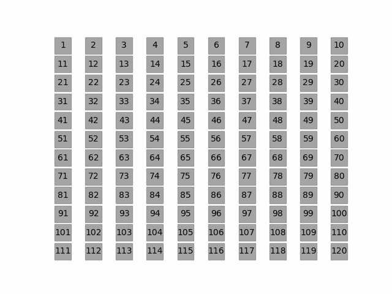

# Sieve of Eratosthenes
Just a fun little project to reproduce the visual created on Wikipedia on the page for Sieve of Eratosthenes. Hurricane Ian knocked out my roommate and I's internet, so we worked on separate versions of this to pass the time. 
Some future improvements might include adding the text on the right, letting the user change the top range of the sieve, changing colors, or even displaying this with a different format (circles, or spirals, etc.)

Original:

My version:

